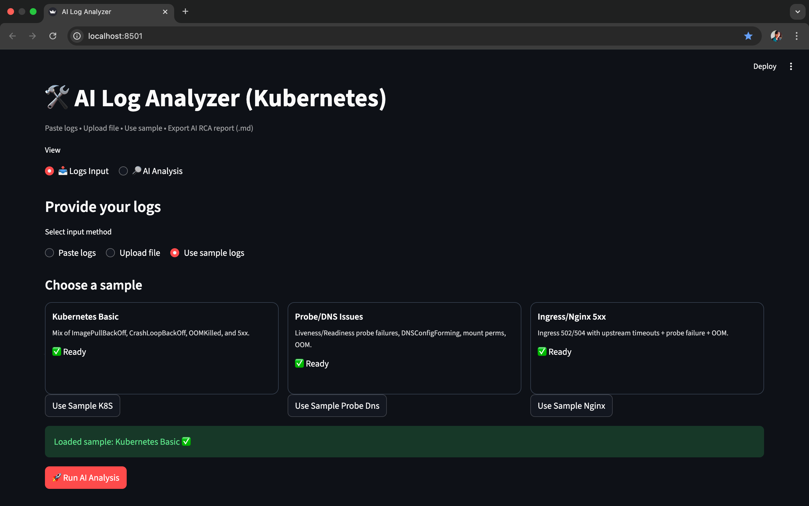
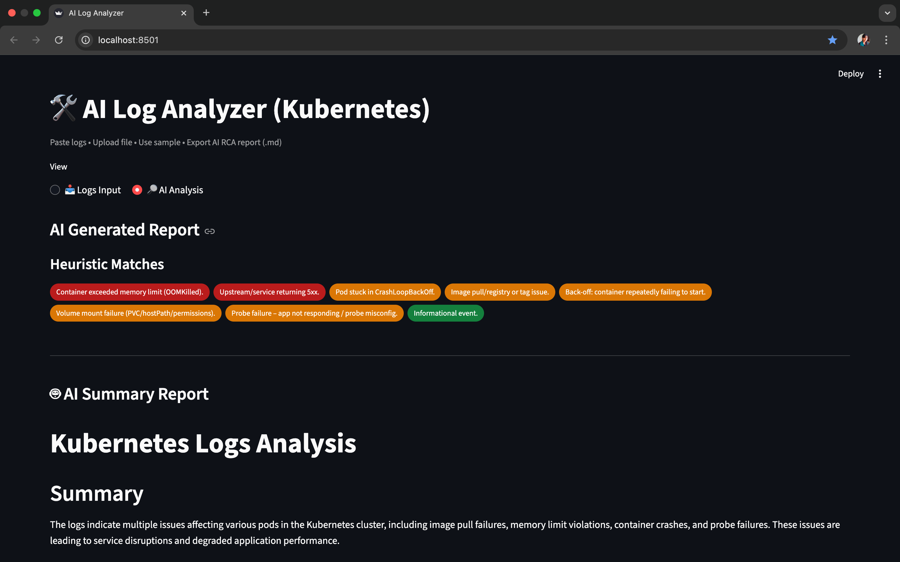

# 🛠️ AI Log Analyzer (Kubernetes)


**Detects, explains and recommends fixes for Kubernetes failures automatically.**

A developer-friendly AIOps tool that reads Kubernetes/Ingress logs, flags known failure patterns (heuristics), and generates a concise **Root-Cause + Fix** report using an LLM. Built to demo your **AI + DevOps** chops in minutes.

---

## 🔥 Why this matters
Traditional log triage is slow and noisy. This tool turns raw logs into **actionable steps**:
- What happened (summary)
- Why it likely happened (probable root cause)
- **Exact commands** to fix (e.g., `kubectl`/config changes)
- Next steps to prevent recurrence

Perfect for: **portfolio projects, interviews, internal demos, and AIOps POCs**.

---

## ✅ Features
- **K8s heuristics with severity** (CrashLoopBackOff, OOMKilled, ImagePullBackOff, 5xx, FailedMount, Probes)
- **LLM reasoning** (OpenAI `gpt-4o-mini` by default) → Root-cause + remediation steps
- **Streamlit UI** with paste / upload / sample logs
- **One-click export** to Markdown report
- Zero infra setup — runs as a desktop web app

---

## 🧠 Architecture

```mermaid
graph LR
  A[User Logs (Paste / Upload / Sample)] --> B[Parser]
  B --> C[Heuristics Engine (CrashLoopBackOff / OOM / 5xx / Mount / Probes)]
  B -->|raw log text| D[LLM Prompt Builder]
  C -->|hints| D
  D --> E[OpenAI API (gpt-4o-mini)]
  E --> F[Markdown RCA (Summary • Root Cause • Fix)]
  F --> G[Streamlit UI (Badges + Download)]
✨ Screenshots
1️⃣ Logs Input (Sample Cards UI)
<table width="100%"><tr><td align="center" style="border:1px solid #e5e7eb; border-radius:10px; padding:14px;"> <b>Logs Input (Sample Cards UI)</b><br/>  </td></tr></table>
2️⃣ AI Analysis (Badges + RCA Summary)
<table width="100%"><tr><td align="center" style="border:1px solid #e5e7eb; border-radius:10px; padding:14px;"> <b>AI Analysis (Badges + RCA Summary)</b><br/>  </td></tr></table>
🚀 Quickstart
<details> <summary><b>Click to expand installation steps</b></summary>
✅ 1) Clone & install
bash
Copy code
git clone https://github.com/komalrastogi/ai-log-analyzer.git
cd ai-log-analyzer
pip3 install -r requirements.txt
🔐 2) Set your OpenAI key
bash
Copy code
echo "OPENAI_API_KEY=sk-xxxxxxxxxxxx" > .env
▶️ 3) Run the UI
bash
Copy code
python3 -m streamlit run app/ui.py
</details>
🧪 Sample Logs
📄 File	⚙️ Scenario
k8s_sample.log	Mixed Kubernetes errors (ImagePullBackOff, CrashLoopBackOff, OOM)
k8s_probe_dns.log	Probe failures + DNSConfig issues + FailedMount
nginx_5xx.log	Ingress 502/504 upstream failures

🧩 How it works
parser.py → Parses raw logs into structured events

heuristics.py → Detects patterns and assigns severity

ai_summary.py → Converts logs + hints → LLM prompt

ui.py → Streamlit web UI with export option

🧑‍💼 Resume-ready summary
Built an AI-based Kubernetes Log Analyzer using heuristic pattern detection and LLM reasoning to produce actionable root-cause reports with a polished web UI.

🗺️ Roadmap
✅ RCA + UI export

🔜 Self-healing actions (auto restart / scale)

🔜 Multi-agent (Healer + Validator)

🔜 HuggingFace offline fallback

📜 License
MIT
